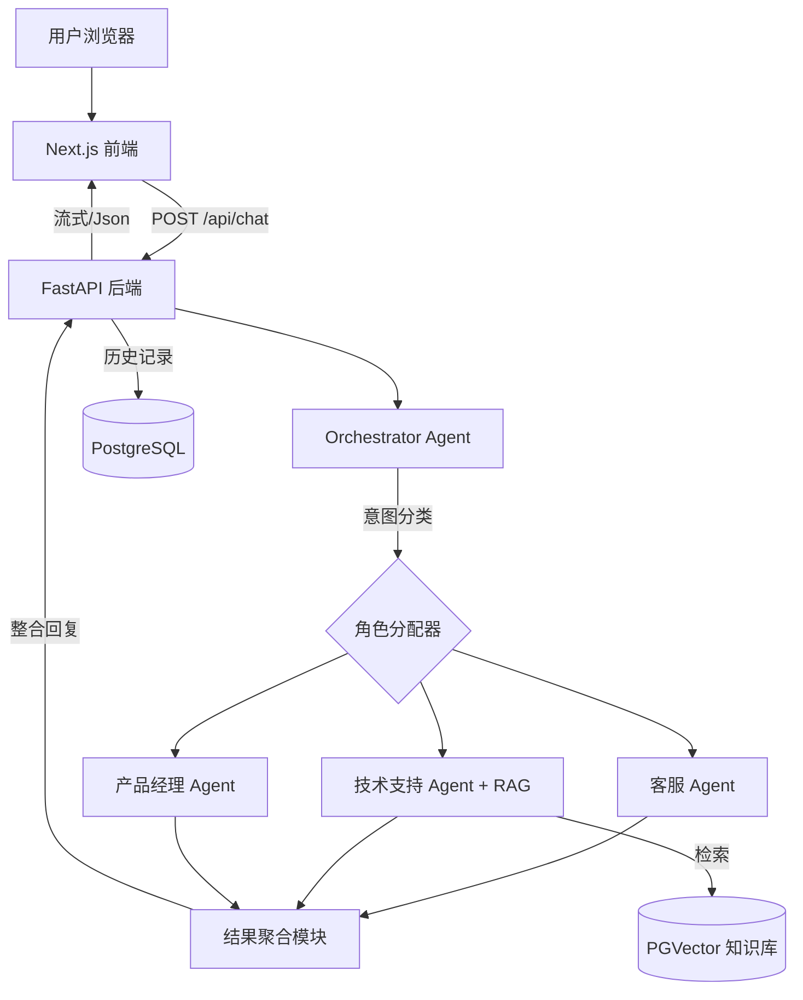

# 多角色智能问答 Agent 系统规格书

> **目标**：构建一个可演示的多角色协作 AI Agent，展示全栈开发能力、RAG 技术与 Prompt 工程。
> **适用模式**：将此文档作为 Cursor 的项目上下文，让 AI 助手按步骤生成完整代码。

---

## 1. 核心功能

- **多角色预设**：客服（Customer Service）、技术支持（Technical Support）、产品经理（Product Manager）
- **智能分发**：根据用户问题自动判断需要哪些角色参与回答
- **协作回答**：整合多个角色的观点，生成连贯回复，并标注角色来源
- **上下文记忆**：基于会话的多轮对话能力，自动关联历史记录
- **RAG 增强**：技术支持角色可检索知识库（文档），给出更精准的答案
- **流式响应**（可选）：提升用户体验

---

## 2. 技术栈与依赖

### 后端

- **语言**：Python 3.11+
- **框架**：FastAPI
- **AI 框架**：LangChain (langchain, langchain-openai, langchain-community)
- **LLM**：阿里通义千问
- **向量数据库**：PostgreSQL + pgvector
- **数据库 ORM**：SQLAlchemy (async)
- **其他**：Pydantic, uvicorn, python-dotenv, aiofiles
- **运行方式**：使用 Python 虚拟环境（venv）启动并运行项目

### 前端

- **框架**：Next.js 14 (App Router)
- **UI**：React + Tailwind CSS
- **AI SDK**：Vercel AI SDK（处理流式请求）
- **请求库**：fetch

### 基础设施

- **数据库**：PostgreSQL Ubuntu 14.22（需安装 pgvector 扩展）
- **容器化**（可选）：Docker Compose

---

## 3. 系统架构

